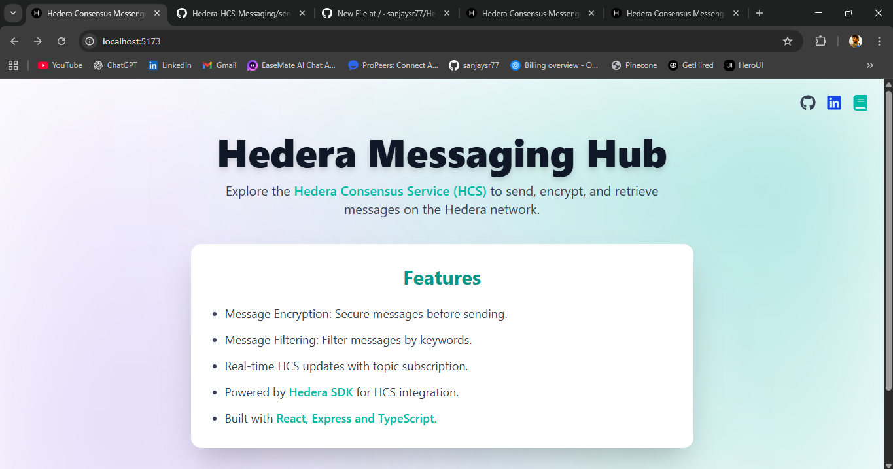
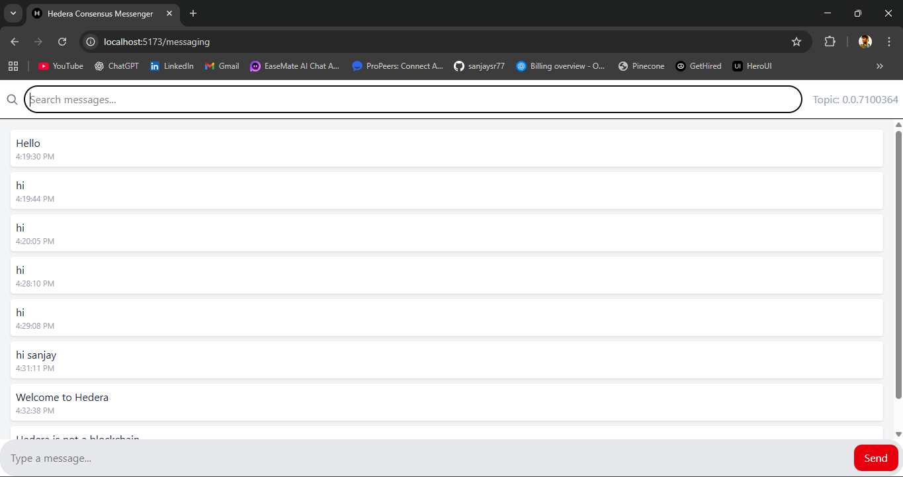
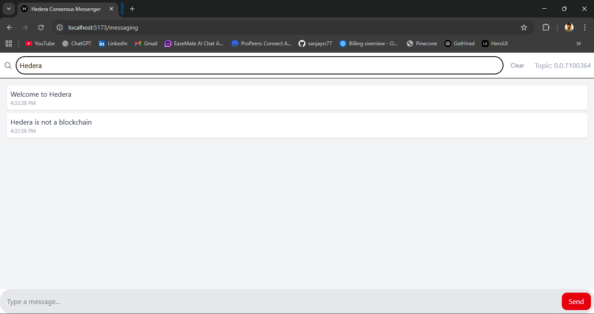

# Hedera HCS Messaging

A real-time messaging application built with Hedera's Hash-Graph Consensus Service (HCS). Messages are end-to-end encrypted and stored on the Hedera network.

## Screenshots

### Landing Page


### Messaging Interface


### Message Search


## Features

- Real-time messaging using WebSockets
- End-to-end encryption
- Message history with search functionality
- Built with React, TypeScript, and Express

## Quick Start

### Prerequisites

- Node.js 18+ installed
- Hedera testnet account with operator ID and key

### Backend Setup

```bash
# Clone the repository
git clone https://github.com/sanjaysr77/Hedera-HCS-Messaging.git
cd Hedera-HCS-Messaging/server

# Install dependencies
npm install

# Create .env file
echo "PORT=8080
OPERATOR_ID=your_hedera_operator_id
OPERATOR_KEY=your_hedera_operator_key
> .env

# Start the server
npm run dev
```

### Frontend Setup

```bash
# In a new terminal, from project root
cd client

# Install dependencies
npm install

# Create .env file
echo "VITE_API_BASE_URL=http://localhost:8080" > .env

# Start the development server
npm run dev
```

Visit `http://localhost:5173` in your browser.

## Environment Variables

### Backend (.env)
- `PORT`: Server port (default: 8080)
- `OPERATOR_ID`: Your Hedera account ID
- `OPERATOR_KEY`: Your Hedera private key
- `ALLOWED_ORIGINS`: Comma-separated list of allowed CORS origins

### Frontend (.env)
- `VITE_API_BASE_URL`: Backend API URL
  - Local: `http://localhost:8080`

## License

MIT
